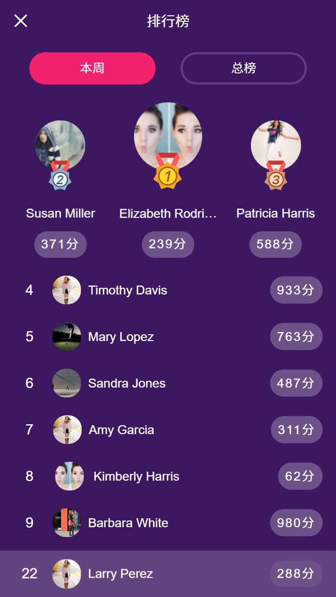
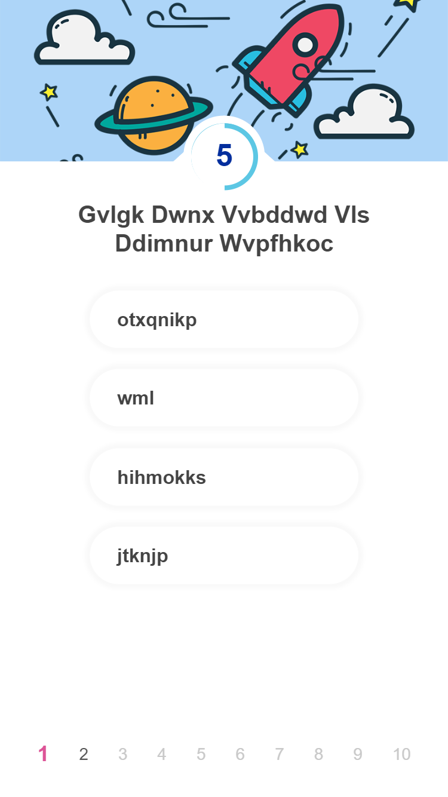

# 答题游戏


> A question-and-answer game

## 技术栈

- Vue 及其全家桶
- scss
- mockjs 请求拦截

## 构建步骤

```bash
# install dependencies
yarn

# serve with hot reload at localhost:8080
yarn run dev

# build for production with minification
yarn run build

# build for production and view the bundle analyzer report
yarn run build --report
```

## 页面截图

<div align="center">
	
	<br>
	<span>首页</span>
</div>

<div align="center">
	
	<br>
	<span>排行榜界面</span>
</div>

<div align="center">
	
	<br>
	<span>邀请界面</span>
</div>

<div align="center">
	
	<br>
	<span>答题界面</span>
</div>
